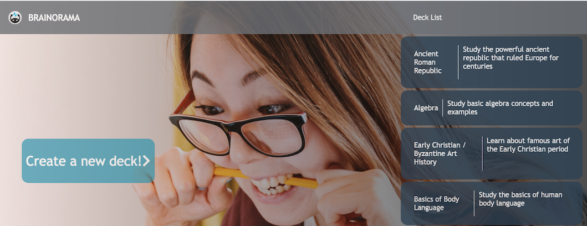

## Welcome to BrainOrama

BrainOrama is a website designed to help users study and learn a wide range of topics.  Users can create their own decks of flashcards, and browse decks made by other users if they're curious!

[Visit the site here!](http://brainorama.herokuapp.com/#/)



## How It Works

Users are able to create any number of decks from the Deck List page.  Once a deck has been created, it's creator can easily add flashcards, giving each card a question and answer, either of which they can edit later if desired.  Users can navigate the cards in a deck, see the given question, and reveal its answer when they're ready.

## Technologies Used

BrainOrama was built using a combination of Ruby on Rails with PostgreSQL, React, Redux, Javascript, HTML, CSS and the [animate.css library](https://github.com/daneden/animate.css).  Ruby on Rails was used to format the back end.  React and Redux were used to connect the Rails back end to the front end and design the User Interface.  HTLM, CSS and animate.css were used to enhance the User Experience.

## Specific Features

### Add Decks and Cards

You can easily create a deck for any subject you wish directly from the Deck List page.  All you need is a name for your deck and a brief description.  Once you've made your deck, you're brought to a page where you can just as easily add flashcards.  Each card requires a question and an answer.  Once you've made a card, a button appears on your deck's page allowing you and other users to begin studying!

Simple Rails associations allowed me to easily allow Users to have many Decks and Decks to have many Cards.  Deck and Card show pages have a number of buttons only visible to the item's creator to edit and delete them.  Here's a snippet demonstrating the logic behind protecting those options:

```
if (currUserId === this.props.card.author_id) {
  display = <div className='card-show-extra-btns-div'>
  <Link className='card-show-edit-link' to={`/decks/${this.props.match.params.deckId}/cards/${this.props.card.id}/edit`}>EditCard</Link>
  <button className='card-show-delete-btn' onClick={this.handleDelete}>Delete Card</button>
</div>
}
```

### Testing Yourself with Flashcards

After creating a card or cards for your deck, or finding a deck you're interested in, you can study its cards from the deck's show page.  When you click on a card button, you're brought to a page displaying the card's question.  When you're ready, a button will allow you to reveal the answer.  You can then hide the answer again if you wish.

This was accomplished by adding a key/value pair to the page's state to keep track of a boolean indicating if the answer should be hidden or revealed.  Then a simple JavaScript boolean statement is used to determine if the element containing the answer should be displayed or not:

``<div className='card-show-answer-div'>{this.state.showAnswer && (<div className='card-show-answer animated flipInX'>{this.props.card.answer}</div>)}</div>``


## Future Plans for BrainOrama

* Users can track their study progress with any given deck of cards.
* Users can see and navigate to decks they are actively studying.
* Users can navigate from card to card when studying, rather than navigating back and forth from the deck page.
* Decks are ogranized by subject and can be found with a serach function.
